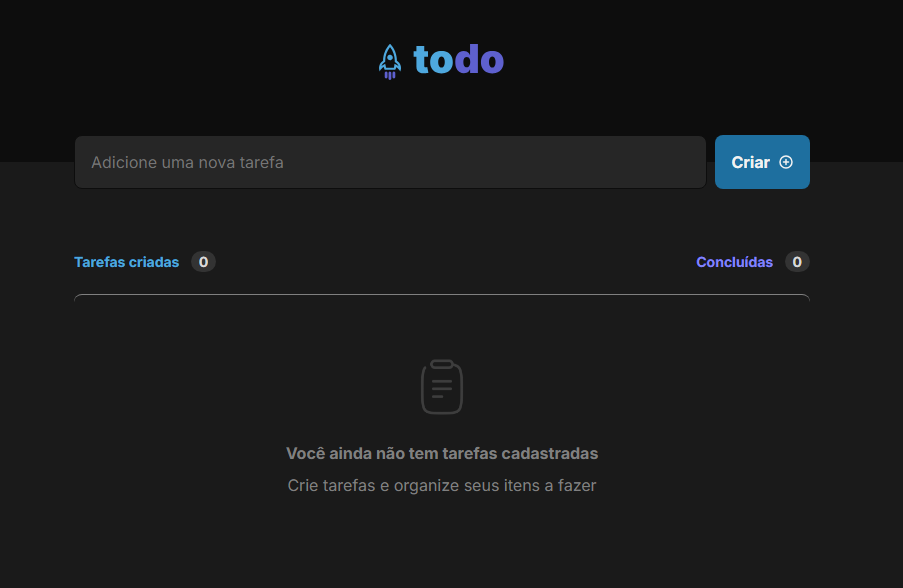

<h1 align="center"> ToDo List </h1>

Projeto realizado com o objetivo de aprofundar os conhecimentos em React.js e JavaScript. A aplicação consiste em uma lista de afazeres, onde é possível adicionar atividades, marcá-las como concluídas ou excluí-las.

  

## 🚀 Tecnologias

Esse projeto foi desenvolvido com as seguintes tecnologias:

- HTML e CSS
- Java Script
- Typescript
- React.js
- Git e Github
- Figma

## 🔖 Layout

Você pode visualizar o layout do projeto através [DESSE LINK](https://www.figma.com/design/doPMP2sVP5KJ61PHJQIAId/ToDo-List-%E2%80%A2-Desafio-React-(Copy)?node-id=56-96&t=FjkPYbe3m3iYFadz-0). É necessário ter conta no [Figma](https://figma.com) para acessá-lo.
